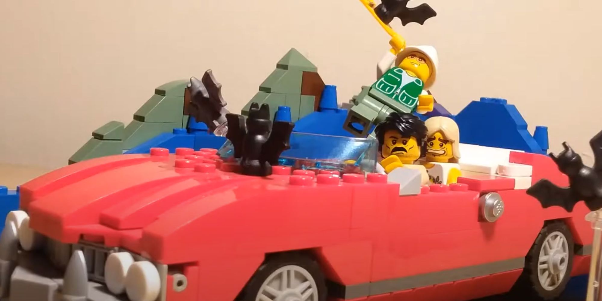

# Project README

## Эпиграф

У нас было 2 строительных пластины, 30 пакетиков точек, 4 квадратных ячеистых пластиковых контейнера, светодиодная лента и целое множество инструментария всяческих вендоров и наименований, столы, а также системные блоки, мониторы и периферия, ящики локеры, пинта негазированной минералки и две дюжины репозиториев на гитхабе.
Не то чтобы это был необходимый запас для проекта, но если уж начал собирать лего, становится трудно остановиться. Единственное, что вызывало у меня опасение - это пенопласт. Ничто в мире не бывает более невесомым, бесструктурным и непрочным, чем пенопластовые конструкции. Я знал, что рано или поздно мы настрогаем и эту грань.